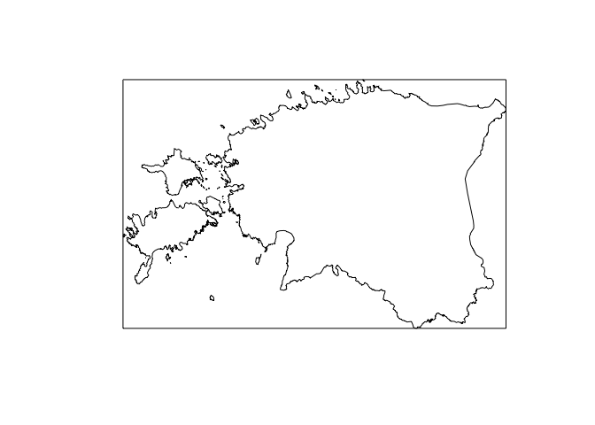

Untitled
================

``` r
library("sf")
```

    ## Linking to GEOS 3.6.1, GDAL 2.1.3, proj.4 4.9.3

``` r
library("raster")
```

    ## Loading required package: sp

``` r
eesti_sp <- getData("GADM", country="EST", level = 0)

eesti <- eesti_sp %>%
  st_as_sf() %>%
  st_transform(3301) %>%
  st_simplify(dTolerance = 200) 

bbox2poly <- function(geom) {
  bb <- st_bbox(geom)
  crs <- st_crs(bb)
  pts <- rbind(
    c(bb[1], bb[2]),
    c(bb[3], bb[2]),
    c(bb[3], bb[4]),
    c(bb[1], bb[4]),
    c(bb[1], bb[2])
  )
  out <- st_polygon(list(pts))
  out <- st_sfc(out, crs = crs)
  out
}

plot(eesti[, 1], col = 0, main = "")
plot(st_boundary(bbox2poly(eesti)), add = TRUE)
```


