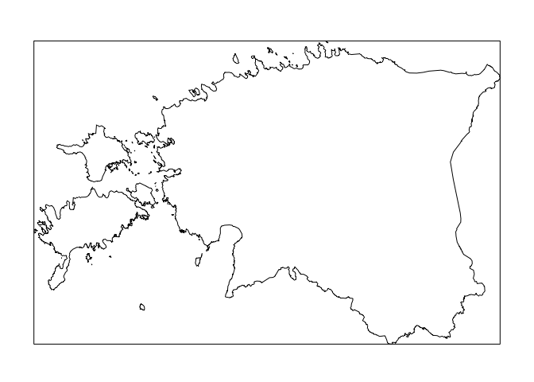

Miscellaneous spatial stuff
================

[Snap points to lines or polygons](snap-points.md)


[Convert marked points to polygons](marked-points-to-polygons.md)


[Frontline-like data and deriving features](frontlines.md)


One off things that don't fit elsewhere yet
-------------------------------------------

### Bounding box to polygon

``` r
library("sf")
library("raster")

bbox2poly <- function(geom) {
  bb <- st_bbox(geom)
  crs <- st_crs(bb)
  pts <- rbind(
    c(bb[1], bb[2]),
    c(bb[3], bb[2]),
    c(bb[3], bb[4]),
    c(bb[1], bb[4]),
    c(bb[1], bb[2])
  )
  out <- st_polygon(list(pts))
  out <- st_sfc(out, crs = crs)
  out
}

eesti_sp <- getData("GADM", country="EST", level = 0, path = "data")

eesti <- eesti_sp %>%
  st_as_sf() %>%
  st_transform(3301) %>%
  st_simplify(dTolerance = 200) 

plot(eesti[, 1], col = 0, main = "")
plot(st_boundary(bbox2poly(eesti)), add = TRUE)
```


